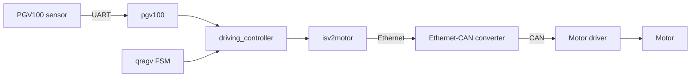

# QRAGV Prototype

QRAGV는 ROS를 사용하지 않고 C++와 CMake로 구성한 AGV(Automated Guided Vehicle) 제어 프로토타입입니다. NVIDIA Jetson Nano에서 PGV100 광학 위치 센서와 ISV2 모터를 연동하고, 센서 데이터에 따라 차량을 제어하는 구조를 직접 구현하고 학습하기 위해 개발했습니다.

## 개발 환경

| 항목 | 내용 |
| --- | --- |
| 대상 보드 | NVIDIA Jetson Nano |
| 운영체제 | Ubuntu Linux (버전 미확인) |
| 소스에 기록된 커널 | Linux 4.9.253-tegra |
| 언어 | C / C++14 |
| 빌드 시스템 | CMake |
| 실행 구조 | 독립 실행형 애플리케이션 (ROS 미사용) |
| 실행 파일 | `QRAGV` |
| 주요 장치 | Ethernet-CAN converter, ISV2 motor driver and motor, Pepperl+Fuchs PGV100 optical positioning sensor |

> Ubuntu 버전은 당시 개발 환경 기록이 남아 있지 않아 특정하지 않았습니다. `Linux 4.9.253-tegra`는 소스 헤더에서 확인된 커널 정보입니다.

## 프로젝트 구조

| 모듈 | 역할 |
| --- | --- |
| `modules/hw_interface` | 센서와 액추에이터 모듈에서 공통으로 사용할 하드웨어 인터페이스 및 생명주기 상태를 정의합니다. |
| `modules/isv2motor` | Ethernet을 통해 컨버터와 통신하고, 컨버터 이후의 CAN 네트워크에 연결된 ISV2 모터 드라이버의 명령과 상태 데이터를 처리합니다. |
| `modules/pgv100` | Jetson의 UART 인터페이스를 통해 Pepperl+Fuchs PGV100 광학 위치 센서 데이터를 수신하고 처리합니다. |
| `modules/driving_controller` | PGV100 위치 정보와 ISV2 모터 제어 기능을 결합하여 차량의 주행 동작을 처리합니다. |
| `modules/qragv` | 시스템 초기화, 상태 머신(FSM), 주행 제어 및 서버 기능을 관리하는 최상위 제어 모듈입니다. |

## 동작 흐름

1. 프로그램이 `QRAGV::Initialize()`를 호출하여 하드웨어 인터페이스와 제어 모듈을 초기화합니다.
2. `pgv100` 모듈이 UART를 통해 광학 위치 센서 데이터를 수신합니다.
3. `driving_controller`가 센서 정보와 현재 주행 상태를 바탕으로 필요한 모터 동작을 결정합니다.
4. `isv2motor` 모듈이 Ethernet을 통해 컨버터로 제어 데이터를 전달합니다.
5. 컨버터가 Ethernet 데이터를 CAN 통신으로 변환하여 모터 드라이버에 전달하고, 모터 드라이버가 실제 모터를 제어합니다.
6. 메인 루프가 `QRAGV::Drive()`를 반복 호출하며, `qragv` 모듈의 FSM이 전체 시스템 동작을 관리합니다.



## 주요 구현 내용

- ROS에 의존하지 않는 독립 실행형 Linux C++ 애플리케이션
- 최상위 `CMakeLists.txt`를 이용한 프로젝트 전체 통합 빌드
- Ethernet-CAN 컨버터를 통한 ISV2 모터 제어 인터페이스
- Ethernet → 컨버터 → CAN → 모터 드라이버 → 모터로 이어지는 제어 구조
- Linux UART 기반 PGV100 광학 위치 센서 인터페이스
- 공통 하드웨어 인터페이스와 장치 생명주기 상태 정의
- 센서와 모터를 결합한 주행 제어 계층
- FSM 기반의 최상위 AGV 동작 관리
- 직선 주행을 부드럽게 하기 위한 S-curve 속도 프로파일 적용

## 알려진 한계

- 별도의 상태 추정 필터를 사용하지 않아 장시간 주행 시 추정 위치가 실제 위치에서 점차 벗어날 수 있습니다.

## 빌드

```bash
mkdir -p build
cd build
cmake ..
cmake --build .
```

빌드가 완료되면 `QRAGV` 실행 파일이 생성됩니다. 실행 전 Jetson Nano의 Ethernet 및 UART 인터페이스, Ethernet-CAN 컨버터, CAN 네트워크와 모터 드라이버가 프로젝트 설정에 맞게 구성되어 있어야 합니다.

## 프로젝트 목적

이 프로젝트는 ROS와 같은 로봇 프레임워크를 사용하지 않고 Linux C++ 환경에서 하드웨어 인터페이스, 센서 데이터 처리, 모터 제어, 상태 머신 및 상위 주행 제어 구조를 직접 구현하고 학습하기 위한 프로토타입입니다.

---

# QRAGV Prototype

QRAGV is a standalone Automated Guided Vehicle (AGV) control prototype built with C++ and CMake without ROS. It was developed to study and implement an architecture that integrates a PGV100 optical positioning sensor with ISV2 motor control on an NVIDIA Jetson Nano.

## Development Environment

| Item | Details |
| --- | --- |
| Target board | NVIDIA Jetson Nano |
| Operating system | Ubuntu Linux (version unknown) |
| Kernel recorded in source | Linux 4.9.253-tegra |
| Languages | C / C++14 |
| Build system | CMake |
| Runtime structure | Standalone application (without ROS) |
| Executable | `QRAGV` |
| Main devices | Ethernet-CAN converter, ISV2 motor driver and motor, Pepperl+Fuchs PGV100 optical positioning sensor |

> The exact Ubuntu version is not specified because no reliable record of the original distribution version remains. `Linux 4.9.253-tegra` is the kernel information found in the source headers.

## Project Structure

| Module | Responsibility |
| --- | --- |
| `modules/hw_interface` | Defines common hardware interfaces and lifecycle states for sensor and actuator modules. |
| `modules/isv2motor` | Communicates with the converter over Ethernet and handles commands and status data for the ISV2 motor driver connected to the downstream CAN network. |
| `modules/pgv100` | Receives and processes data from the Pepperl+Fuchs PGV100 optical positioning sensor through the Jetson UART interface. |
| `modules/driving_controller` | Combines PGV100 position information with ISV2 motor control to manage vehicle motion. |
| `modules/qragv` | Top-level module responsible for system initialization, the finite-state machine (FSM), driving control, and server functions. |

## Control Flow

1. The program calls `QRAGV::Initialize()` to initialize the hardware interfaces and control modules.
2. The `pgv100` module receives optical positioning data over UART.
3. The `driving_controller` determines the required motor action from the sensor data and current driving state.
4. The `isv2motor` module sends control data to the converter over Ethernet.
5. The converter translates the Ethernet data to CAN and forwards it to the motor driver, which controls the physical motor.
6. The main loop repeatedly calls `QRAGV::Drive()`, while the FSM in the `qragv` module manages overall system behavior.


## Key Implementations

- Standalone Linux C++ application without ROS dependencies
- Unified project build through the top-level `CMakeLists.txt`
- ISV2 motor-control interface using an Ethernet-CAN converter
- Control path from Ethernet to converter, CAN, motor driver, and motor
- Linux UART-based PGV100 optical positioning sensor interface
- Common hardware interfaces and device lifecycle states
- Driving-control layer integrating sensor input with motor output
- FSM-based top-level AGV behavior management
- S-curve velocity profiling for smoother straight-line driving

## Known Limitations

- Because no additional state-estimation filter is used, the estimated position may gradually drift from the actual position during long-term operation.

## Build

```bash
mkdir -p build
cd build
cmake ..
cmake --build .
```

The build generates the `QRAGV` executable. Before running it, the Jetson Nano Ethernet and UART interfaces, Ethernet-CAN converter, CAN network, and motor driver must be configured according to the project settings.

## Project Purpose

This project was created to study and implement hardware interfaces, sensor-data processing, motor control, state-machine design, and higher-level vehicle control directly in a Linux C++ environment without relying on a robotics framework such as ROS.