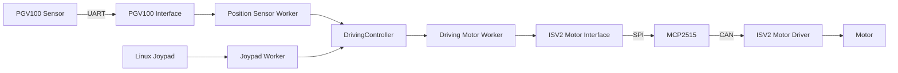

# QRAGV Prototype

QRAGV는 ROS를 사용하지 않고 C++와 CMake로 구성한 AGV(Automated Guided Vehicle) 제어 프로토타입입니다. NVIDIA Jetson Nano에서 PGV100 광학 위치 센서와 ISV2 모터 드라이버를 직접 연동하고, Linux 환경에서 센서·모터 인터페이스와 주행 제어 구조를 구현하고 학습하기 위해 개발했습니다.

## 개발 환경

| 항목 | 내용 |
| --- | --- |
| 대상 보드 | NVIDIA Jetson Nano |
| 운영체제 | Ubuntu Linux (버전 미확인) |
| 소스에 기록된 커널 | Linux 4.9.253-tegra |
| 언어 | C / C++14 |
| 빌드 시스템 | CMake |
| 실행 구조 | 독립 실행형 애플리케이션 (ROS 미사용) |
| 주요 인터페이스 | UART, SPI, CAN |
| 주요 장치 | Pepperl+Fuchs PGV100 optical positioning sensor, MCP2515 CAN controller, ISV2 motor driver and motor |

> Ubuntu 버전은 당시 개발 환경 기록이 남아 있지 않아 특정하지 않았습니다. `Linux 4.9.253-tegra`는 소스 헤더에서 확인된 커널 정보입니다.

## 프로젝트 구조

| 모듈 | 역할 |
| --- | --- |
| `modules/hw_interface` | 센서와 액추에이터 모듈에서 공통으로 사용할 하드웨어 인터페이스 및 생명주기 상태를 정의합니다. |
| `modules/pgv100` | Jetson Nano의 UART 인터페이스를 통해 PGV100 광학 위치 센서 데이터를 요청·수신하고 위치/각도 정보를 처리합니다. |
| `modules/isv2motor` | Jetson Nano의 SPI를 통해 MCP2515 CAN controller를 제어하고, CAN 네트워크의 ISV2 모터 드라이버 명령 및 상태 데이터를 처리합니다. |
| `modules/driving_controller` | PGV100 위치 정보와 ISV2 모터 데이터를 통합하고, 주행 제어와 worker thread 관리를 담당합니다. |

현재 실행 구조에서는 별도의 최상위 FSM을 사용하지 않고 `main.cpp`에서 `DrivingController`를 직접 생성하여 초기화한 뒤 `Drive3()`를 반복 호출합니다.

## 동작 구조

`DrivingController`는 센서와 모터 기능을 별도 worker thread로 실행하고, mutex로 공유 데이터를 동기화합니다.

- `PostionSensorWorker` : PGV100 sensor interface 실행 및 위치 데이터 전달
- `DrivingMotorWorker` : ISV2 motor interface 실행, CAN 명령 송수신 및 모터 상태 전달
- `JoypadWorker` : Linux joystick 입력을 이용한 수동 주행 테스트
- `DrivingController::Drive3()` : 최신 QR 기반 주행 제어 로직 실행



## 주요 구현 내용

- ROS에 의존하지 않는 독립 실행형 Linux C/C++ 로봇 제어 애플리케이션
- 최상위 `CMakeLists.txt`를 이용한 프로젝트 통합 빌드
- Linux UART 기반 PGV100 광학 위치 센서 인터페이스
- PGV100 request telegram 송신, timeout 처리, 응답 길이 및 checksum 검사, 위치·각도 데이터 파싱
- Linux user-space 기반 SPI-MCP2515 CAN 인터페이스 구현
- MCP2515 register 설정, CAN 송수신 및 timeout 처리
- ISV2 모터 명령/상태 인터페이스 구현
- 모터 encoder 기반 odometry 계산
- PGV100 위치 정보와 motor encoder 데이터를 결합한 주행 제어
- sensor / motor / joypad worker thread 분리 및 mutex 기반 데이터 동기화
- 목표 위치 queue 기반 주행 시퀀스 처리
- 방향각 계산, 목표 자세 회전 및 좌·우 모터 속도 명령 생성
- 직선 주행을 부드럽게 하기 위한 S-curve velocity profile 적용
- QR Tag 위치 정보를 이용한 위치 및 방향 보정 주행

## 주행 제어 버전

소스에는 개발 과정에서 사용한 여러 주행 제어 버전이 남아 있습니다.

- `Drive()` : S-curve 기반 기본 직선 이동 제어
- `Drive2()` : odometry 기반 주행 제어
- `Drive3()` : QR Tag 위치 정보를 이용한 주행 제어

현재 `main.cpp`에서는 `Drive3()`를 실행합니다.

## 알려진 한계

- 별도의 상태 추정 필터를 사용하지 않아 encoder 기반 odometry는 장시간 주행 시 실제 위치와 오차가 누적될 수 있습니다.
- 테스트 및 개발 과정의 코드가 일부 남아 있어 production용 software보다는 선행개발/학습 prototype 성격의 프로젝트입니다.

## 빌드

```bash
mkdir -p build
cd build
cmake ..
cmake --build .
```

빌드가 완료되면 `QRAGV` 실행 파일이 생성됩니다. 실행 전 Jetson Nano의 UART/SPI 인터페이스, MCP2515 CAN controller, CAN network와 ISV2 motor driver가 프로젝트 설정에 맞게 구성되어 있어야 합니다.

## 프로젝트 목적

이 프로젝트는 ROS와 같은 로봇 프레임워크에 의존하지 않고 Linux C++ 환경에서 하드웨어 인터페이스, 센서 데이터 처리, CAN 모터 제어, multi-thread 기반 데이터 처리와 상위 주행 제어 구조를 직접 구현하고 학습하기 위한 프로토타입입니다.

---

# QRAGV Prototype

QRAGV is a standalone AGV control prototype built with C/C++ and CMake without ROS. It was developed to study and implement Linux-based hardware interfaces and vehicle-control software on an NVIDIA Jetson Nano.

## Architecture

- PGV100 optical positioning sensor via Linux UART
- MCP2515 CAN controller via Linux user-space SPI
- ISV2 motor driver over CAN
- Sensor, motor, and joystick worker threads
- Mutex-protected data exchange in `DrivingController`
- Encoder odometry, QR-based position correction, and S-curve velocity profiling
- `DrivingController` is instantiated and executed directly from `main.cpp`; no top-level FSM is used in the current runtime structure

## Control Path

```text
PGV100 -> UART -> PGV100 Interface -> Position Sensor Worker
                                         |
                                         v
                                  DrivingController
                                         |
                                         v
                               Driving Motor Worker
                                         |
                                         v
ISV2 Motor <- CAN <- MCP2515 <- SPI <- ISV2 Motor Interface
```

## Purpose

This project was created as a prototype for learning and implementing hardware interfaces, sensor processing, CAN motor control, multi-threaded data exchange, odometry, and higher-level vehicle motion control directly in a Linux C++ environment without relying on a robotics framework such as ROS.
