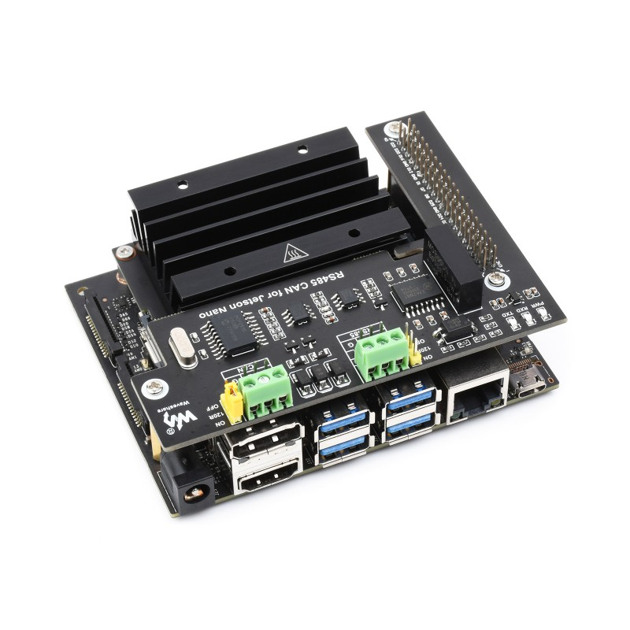
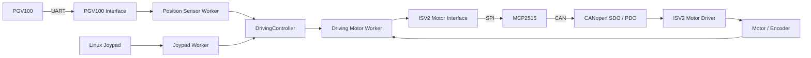
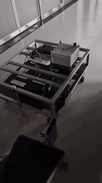

# QRAGV Prototype

QRAGV는 NVIDIA Jetson Nano에서 동작하는 **ROS-less Linux C/C++ AGV 제어 프로토타입**입니다.  
PGV100 광학 위치 센서와 ISV2 모터 드라이버를 직접 연동하고, Linux 사용자 공간에서 센서·모터 인터페이스부터 주행 제어까지 구성해 실제 AGV 주행을 검증했습니다.

<p align="center">
  
</p>

<p align="center">Jetson Nano에서 사용한 RS485/CAN 확장 모듈</p>

## 개발 환경

| 항목 | 내용 |
| --- | --- |
| 메인 컴퓨터 | NVIDIA Jetson Nano |
| 운영체제 | Ubuntu Linux |
| 언어 | C / C++14 |
| 빌드 시스템 | CMake |
| 실행 구조 | 독립 실행형 Linux 애플리케이션 (ROS 미사용) |
| 주요 인터페이스 | UART, SPI, CAN |
| 주요 장치 | Pepperl+Fuchs PGV100, MCP2515, ISV2 motor driver |

## 시스템 구조


```mermaid
flowchart LR
    PGVSENSOR["PGV100"] -->|"UART"| PGV["PGV100 Interface"]
    PGV --> PW["Position Sensor Worker"]

    JOYPAD["Linux Joypad"] --> JW["Joypad Worker"]

    PW --> DC["DrivingController"]
    JW --> DC

    DC --> MW["Driving Motor Worker"]
    MW --> ISV2["ISV2 Motor Interface"]
    ISV2 -->|"SPI"| MCP["MCP2515"]
    MCP -->|"CAN"| CANOPEN["CANopen SDO / PDO"]
    CANOPEN --> DRIVER["ISV2 Motor Driver"]
    DRIVER --> MOTOR["Motor / Encoder"]

    MOTOR --> MW
```

센서, 모터, 조이스틱 기능은 별도 worker thread로 실행하고, `DrivingController`와 공유하는 데이터는 mutex로 보호합니다.

## 직접 구현한 범위

### PGV100 위치 센서 인터페이스

- Linux UART 기반 PGV100 통신 구현
- Request telegram 생성 및 송신
- 응답 수신 timeout 처리
- 응답 길이와 checksum 검사
- 위치, 각도, QR Tag 및 상태 데이터 parsing
- 센서 오류를 상위 제어에 전달하는 상태 처리

### SPI / MCP2515 / CANopen 모터 인터페이스

- Linux user-space SPI 인터페이스를 통해 MCP2515 제어
- MCP2515 register 설정과 CAN frame 송수신
- ISV2 모터 드라이버의 CANopen SDO/PDO 명령 및 응답 처리
- 모터 속도 명령, encoder 및 상태 데이터 처리
- 통신 timeout과 모터 상태 확인

통신 계층은 다음과 같이 구성했습니다.

```text
Linux Application
    ↓
SPI
    ↓
MCP2515
    ↓
CAN Frame
    ↓
CANopen SDO / PDO
    ↓
ISV2 Motor Driver
```

### Multi-thread 제어 구조

- PGV100 sensor worker
- ISV2 motor worker
- Linux joypad worker
- `DrivingController` 주행 제어
- worker와 controller 사이의 공유 데이터는 mutex로 짧게 복사한 뒤 제어·통신 처리는 lock 밖에서 수행

모터 통신은 하나의 CAN bus를 하나의 worker가 소유하도록 구성했습니다. 주기적인 모터 명령과 상태 읽기를 처리하고, 별도 명령이 없을 때도 encoder SDO read를 수행해 모터 상태와 communication watchdog을 유지하도록 구성했습니다.

### Odometry 및 주행 제어

- motor encoder 기반 odometry 계산
- PGV100의 절대 위치 정보를 이용한 위치·방향 보정
- 목표 위치 queue 기반 순차 주행
- 목표 위치와 현재 위치를 이용한 좌·우 모터 속도 생성
- 직선 이동의 급격한 속도 변화를 줄이기 위한 S-curve velocity profile 구현
- QR Tag를 이용한 목표 위치 주행 로직 구현

## 현재 실행 경로

현재 `main.cpp`는 약 10 ms 간격으로 `DrivingController::Drive3()`를 실행합니다.

`Drive3()`는 worker에서 갱신된 센서·모터 데이터를 가져오고 QR 위치 정보를 사용하는 주행 제어를 수행합니다.

개발 과정에서 사용한 이전 주행 제어 코드도 저장소에 남아 있습니다.

- `Drive()` : encoder와 S-curve 기반 초기 주행 제어
- `Drive2()` : odometry 기반 주행 제어
- `Drive3()` : QR 위치 정보를 이용한 주행 제어

## 실제 주행 검증

<p align="center">
  
</p>

<p align="center">QRAGV 실제 주행 검증</p>

실제 Jetson Nano, PGV100, MCP2515 및 ISV2 모터 드라이버를 연결해 센서 수신, CANopen 모터 제어, encoder feedback과 QR 위치 기반 주행을 확인했습니다.

## 저장소 범위

- ROS 및 별도 로봇 프레임워크는 사용하지 않았습니다.
- 별도의 Kalman filter나 SLAM 기반 상태 추정은 포함하지 않습니다.
- 저장소에는 개발·검증 과정에서 사용한 이전 주행 함수와 테스트 코드 일부가 함께 남아 있습니다.
- 프로젝트의 핵심 범위는 **Linux SBC에서의 장치 인터페이스, multi-thread 데이터 처리, CANopen 모터 제어와 실제 AGV 주행 제어 통합**입니다.

## 빌드

```bash
mkdir -p build
cd build
cmake ..
cmake --build .
```

빌드 후 `QRAGV` 실행 파일이 생성됩니다. 실행하려면 Jetson Nano의 UART/SPI 인터페이스와 MCP2515 CAN network, PGV100 및 ISV2 motor driver가 프로젝트의 하드웨어 구성에 맞게 연결되어 있어야 합니다.
